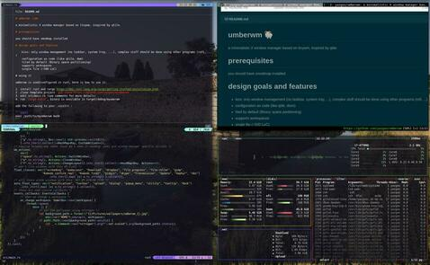

# umberwm :ram:

[](https://discord.gg/F684Y8rYwZ)

Minimalistic X window manager based on tinywm, inspired by qtile.



Video introduction [on LBRY](https://open.lbry.com/@goo:c/umberwm:e?r=FKWhS2Vay3CVr66qMZD98HdsLQ2LN7za) or [on youtube](https://youtu.be/5XdFNEq69N0).

# Prerequisites

You should have xmodmap installed.

You will need XCB bindings with the randr extension. On ubuntu you can install this with `sudo apt install libxcb-randr0-dev`.

# Design goals and features

  - Kiss: only window management (no taskbar, system tray, ...), complex stuff should be done using other programs (rofi, ...)
  - Configuration as code (like qtile, dwm, xmonad)
  - Tiled by default (Binary space partitioning)
  - Supports workspaces
  - Supports multiple displays
  - Single file (~600 LoC)

# Using it

Umberwm is used/configured in rust, here is how to use it:

1. Install rust and cargo https://doc.rust-lang.org/cargo/getting-started/installation.html
2. Clone template project (__:warning: it is a different repository__): `git clone https://github.com/yazgoo/myumberwm`
3. Edit src/main.rs (see comments for more details)
4. Run `cargo build`, binary is available in target/debug/myumerwm

Add the following to your .xinitrc :

```shell
exec /path/to/myumberwm mod4
```
